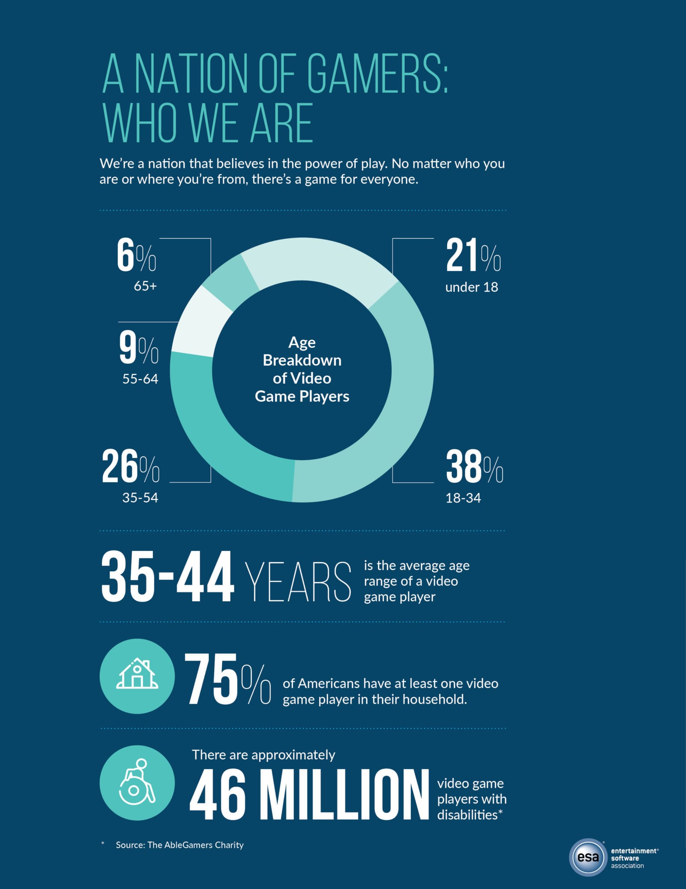

# 1.2 Stakeholders

### Stakeholders

The Entertainment Software Association report on the games industry is a annual insight into the gaming habits of the US population, answering frequently asked questions like who plays video games, why do people play video games and how and when do people play? _\(_[_Entertainment Software Association, 2020_](reference-list.md#entertainment-software-association-2020-essential-facts-online-available-at-https-www-theesa-com-wp-content-uploads-2020-07-final-edited-2020-esa_essential_facts-pdf)_\)_

>

